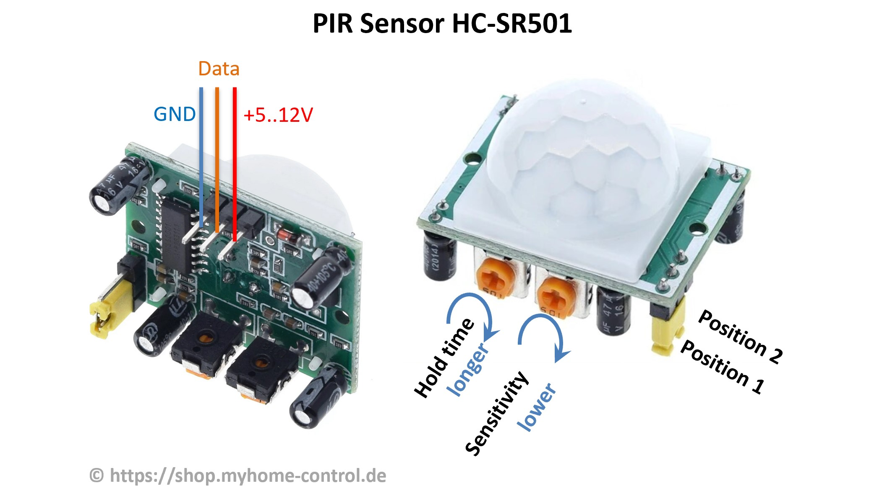
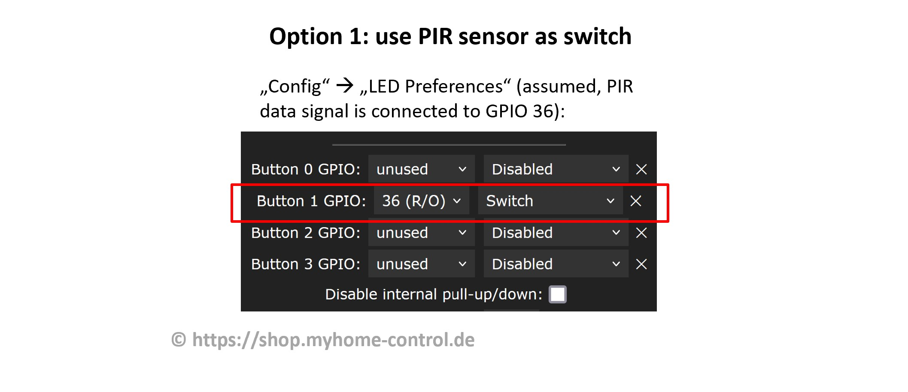
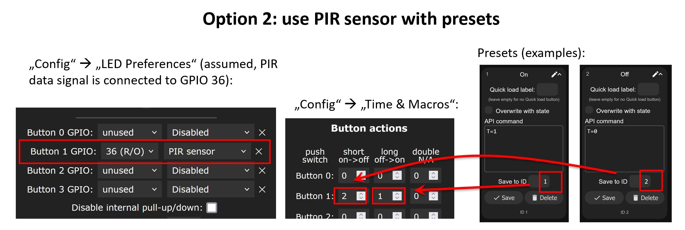

## Introduction

WLED controllers can be used with PIR (Passive InfraRed) sensors for human presense detection. There are two types of sensors:

1. With integrated rotary potentiometers to adjust the sensitivity and the hold time. E.g. HC-SR501 type. These sensors can be connected to WLED and configured as a button.

2. Without integrated possibility to adjust the sensitivity and the hold time. E.g. HC-SR602 type. For these you have to compile WLED with a PIR Sensor Usermod to have these settings in the software.

## Using HC-SR501 sensor

This sensor type has the following features:

1. Three pins for connection (GND, supply voltage 5…12 V, data signal with 3.3V level). Ground (GND) and the supply voltage can be connected directly to a power supply unit (5 V or 12 V). Data signal can be connected directly to a GPIO of an ESP8266 or ESP32 controller.

2. Jumper to switch between two modes. In position 1, when a movement is detected, a HIGH level (3.3V) is output on the data signal and the adjustable holding time is maintained. The data signal then goes back to LOW (0V), regardless of whether the movement is still present or not. If the movement continues, the data signal is switched back to HIGH after a blocking time of approx. 2.5 s. In position 2 it works similarly, but the data signal does not go to LOW as long as the movement is still present. Only when the movement no longer exists for an adjustable holding time, the data signal goes to LOW. So, position 2 is what you normally need.

3. Poti for setting the holding time. If this is turned counterclockwise as far as it will go, the holding time is approx. 3…5 s. In the middle position it is approx. 100 s and in the end position clockwise approx. 200 s.

4. Poti for adjusting the sensitivity. This is approx. 3 to 7 meters and is set lower if you turn the potentiometer clockwise.

In WLED SW you have two options how the sensor can be used:

### Option 1: as a switch

You set a button under “Config->”LED Preferences” so that you can set the GPIO used for the data signal and select “Switch”. Then, when movement is detected, LEDs are switched on and go out after a holding time without movement.

### Option 2: as a PIR sensor

You can set two presets, one of which is activated when movement is detected, and the other when there is no more movement and the hold time has expired. This gives more flexibility to set what exactly should happen.

