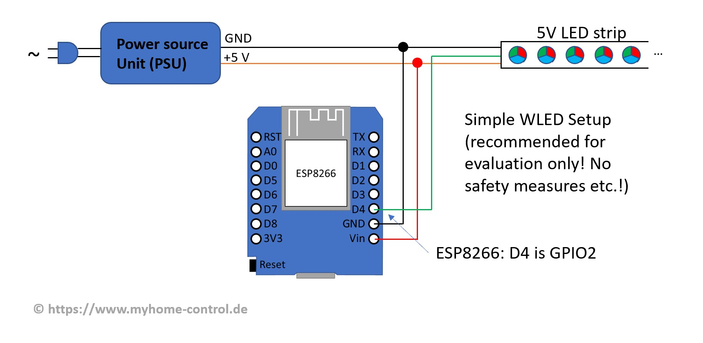
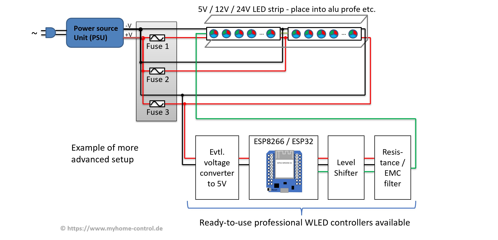

Currently (as of summer 2023) only the microcontrollers from Espressif, types ESP8266 and ESP32 (with dual core) are fully supported. Some of the newer types like ESP32-C3, ESP32-S2 and ESP32-S3 are experimentally supported, but productive use is not recommended yet because some bugs are suspected. In addition, the installation of these newer types is not that easy: there are several hardware variations/boards for which the SW must be specially compiled. It should also be mentioned that some ESP32-C3 boards (so-called C3 mini V1.0.0) are still being sold on the market where WLAN does not work properly.

To try out WLED with 5V addressable strip a simple microcontroller board like ESP8266 D1 mini or ESP32 D1 mini is sufficient. The simplest setup might be like:

However, there are a few other things to keep in mind for a proper setup:

  1. A level shifter is required for reliable data transmission from the controller to the LED strip (this is mandatory, especially with 12V or 24V LED strips). Then you have to solder something together or you can buy a ready-made WLED controller right away.
  2. For safety reasons, the correct cabling (length, cross-section, contacts) and the fuses to be integrated must be considered. Especially with LED strips, it gets more complicated because you need the so-called intermediate feeds. These must be planned and implemented correctly. [LED power, wiring and fuse calculator](https://wled-calculator.github.io/) can be used as an starting point.
  
  3. LED strips can get quite warm during operation and even overheat in the event of a fault. Again, for safety reasons, you have to protect the area around it: you shouldn't just lay LED strips like that, ideally you should integrate them into aluminum profiles or something similar. In normal operation, these act like a heat sink and thus extend the service life of the LEDs. In the event of a fault, they can protect the surroundings.
  4. To save energy while LEDs are off, you might integrate relays that switch the voltage of LEDs off completely.

In the following some third-party controllers are listed. Please use a decent and neutral description when adding things to this list.

 **Gold Member** indicates the product owner makes substantial contributions to the WLED community (financial, code, documentation and/or support).   

!!! tip
    Lists are in alphabetical order. The position of an item in the list does not indicate how good it is or if it will fit your use case.
    Please carefully compare all items in the category you are interested in, and you should find the one that suits your needs best in just a few minutes!   

## Controllers with WLED pre-installed

!!! check "Info"
    Unless otherwise noted, controllers feature everything you need for most WLED setups, except a power supply, wiring and fuses, and of course the LEDs themselves!

!!! info "Transparency Notice"
    Warning Products listed below under the name "Athom" are offered by the company ATHOM Technology Co., Ltd., based in China, which is not affiliated in any way with the European company Athom B.V., makers of the Homey smart home platform.     There is an ongoing legal process against ATHOM Technology Co., Ltd. for possible trademark infringement.
    
| Name | Description |
|---|---|
[8 Port LED Distro](https://www.tindie.com/products/bong69/8-port-led-distro/) | This is an 8 port ESP32 based LED distro board running WLED. Distributing both power and data in 1 board. The WT32-ETH01 provides support for Wi-Fi or ethernet connections. It can be used with either 5v or 12v or 24v LED pixels. Also includes a USB-C port for programming, level shifter, 5 amp fuse on every port, multiple voltage inputs with no jumpers to set and phoenix connectors for easy wiring.
[A1-SLWF-02 ESP8266 WLED controller](https://smartlight.me/led-strips/adressable-led-strips/controller-slwf-02) | WLED specifically designed Controller that supports 5V-12V addressable strips from Ukrainian developers. Based on ESP8266. Slim design, sensor button, powered either by type-C or screw-terminal. Screwdriver included. [Official store, worldwide](https://smartlight.me/led-strips/adressable-led-strips/controller-slwf-02), [Tindie](https://www.tindie.com/products/smartlightme/pixel-addressable-wled-controller-a1-slwf-02-led/), for [NL/BE/DE](https://www.hobbyelectronica.nl/product/led-strip-controller-a1-slwf-02/)  
[A1-SLWF-03 ESP32 WLED controller](https://smlight.tech/product/slwf-03/) | Built-in digital microphone ICS-43434 for soundReactive WLED, ESP32 + 16M, IR receiver, Sensor button, Type-C plug, DC-plug, Screw-terminal, 5-24V, Pinouts for DIY. Specifically designed Controller that supports 5V-24V addressable strips from Ukrainian developers. Slim design. Screwdriver + adhesive tapes included. [Official store, worldwide](https://smartlight.me/led-strips/adressable-led-strips/a1slwf03controller), [Tindie](https://www.tindie.com/products/smartlightme/a1-slwf-03-wled-esp32-controller-home-assistant/), [Aliexpress](https://www.aliexpress.com/item/1005005947819419.html).  
  [ABC! WLED Controller V41 / ESP32](https://shop.myhome-control.de/ABC-WLED-Controller-V41-ESP32/HW10003.1) | Commercial controller for 5V LED strips. Based on ESP32 uC. Two outputs. Option for digital microphone or [line-in-to-I2S Adapter](https://shop.myhome-control.de/Line-In-zu-I2S-Adapter-fuer-WLED-Controller/HW10013) for sound reactive WLED. Ready to use. Additional [Relay&Fuse board](https://shop.myhome-control.de/Relais-Board-fuer-WLED-Controller-5V/HW10005) available. ([German shop & shipping only within Germany or  to Poland](https://shop.myhome-control.de/ABC-WLED-Controller-V41-ESP32/HW10003.1)). A similar one is available at [WLED.SHOP](https://wled.shop/produkt/wladis-wled-controller-v40-esp32/).
  [ABC! WLED Controller V43 / ESP32 based / 5V-24V](https://shop.myhome-control.de/ABC-WLED-Controller-Board-5-24V/HW10015) | Commercial controller board for 5V / 12V / 24V LED strips from creator of [LED power, wiring and fuse calculator](https://wled-calculator.github.io/). Based on ESP32 uC. Preflashed SW. Up to four outputs. Option for digital microphone or [line-in-to-I2S Adapter](https://shop.myhome-control.de/Line-In-zu-I2S-Adapter-fuer-WLED-Controller/HW10013) for sound reactive WLED. Automatic 5V/12V/24V recognition (no jumper/switch etc. required). [Ethernet adapter](https://shop.myhome-control.de/Ethernet-Adapter-fuer-WLED-Controller/HW10016) is available. Enclosure is available too.  [German shop & shipping only within Germany or to Poland.](https://shop.myhome-control.de/ABC-WLED-Controller-Board-5-24V/HW10015)
  [ABC! WLED mini Controller V70 / ESP32 based / 5V-12V](https://shop.myhome-control.de/ABC-WLED-Controller-Board-mini-5V-12V-ESP32/HW10014) | Commercial controller board for 5V / 12V LED strips from creator of [LED power, wiring and fuse calculator](https://wled-calculator.github.io/). Based on ESP32 uC. Preflashed SW. Up to four outputs. Option for digital microphone or [line-in-to-I2S Adapter](https://shop.myhome-control.de/Line-In-zu-I2S-Adapter-fuer-WLED-Controller/HW10013) for sound reactive WLED. Automatic 5V/12V recognition (no jumper/switch etc. required). Enclosure is available.  [German shop & shipping only within Germany or to Poland](https://shop.myhome-control.de/ABC-WLED-Controller-Board-5-24V/HW10015).
[Athom Light Strip Controller](https://www.aliexpress.com/item/1005002198527735.html) | Simple controller with enclosure for reliably driving 3 pin 5V LEDs. Uses 2M ESP8266.
[Athom LS8P ESP32 Music Controller](https://www.athom.tech/blank-1/wled-esp32-music-addressable-led-strip-controller) | ESP32 based controller with dual output, microphone and IR. Comes with WLED preinstalled
[Athom High Power Addressable LED Strip Controller](https://www.athom.tech/blank-1/wled-high-power-led-strip-controller) | Higher power options than the above system. Supports optional clock output.
[Athom RGBW Light Strip Controller](https://www.athom.tech/blank-1/wled-rgbw-light-strip-controller) | Has outputs for individual color channels.
[Cadsbi Motion Smart](https://www.cadsbi-shop.de/shop/led-beleuchtungscontroller/cadsbi-motion-smart/) | Ready to use solution with 3 output ports, an external antenna, in a high quality metal enclosure
  [cod.m WLED Controller](https://shop.codm.de/en/automation/wled/30/wled-controller-wlan/wi-fi) | WLED Controller for 5V/12V/24V strips based in ESP32, complete in case, with plug, including level shifter with 2/4 outputs. Commercially available in Germany throughout Europe. Detailed wiring schemes and documentation.
[Domestic Automation LLC](https://www.domestic-automation.com) | Plug in design makes it the easiest and quickest preinstalled WLED controller to setup! Modular design allows for simple plug-in addition of Motion sensors, Button control, 12V lights and more. Snap track makes for universal mounting. Includes built in fuses and power relay for safety and control. Available on Amazon [here](https://amzn.to/3XFTjpb)
[E8-WiFi Plus](https://computerstyretjulelys.dk/vare/e8-wifi-plus-pixel-controller/) | The E8-WiFi Plus is an advanced 8-port WLED pixel controller built on the robust ESP32 microcontroller, designed for maximum performance and flexibility. It comes fully pre-assembled, supporting a wide voltage range from 5V to 24V DC. With a high output current capacity of up to 30A across all 8 outputs, each is fused by a 5A auto fuse. Features include an external antenna for improved WiFi coverage, dual power input for reliability, spring terminals for easy connections, and a micro-SD card slot for standalone operations. An IR receiver is also included, along with extra connectivity options like access to extra GPIOs and the I2C bus. The controller is also compatible with Xlights, to be used in light shows.
[ESP8266 Pixel Controller](https://www.maltepoeggel.de/?site=pixelcontroller) | DIY board for 5V/12V LED strips with TTL or RS485 output using a Wemos D1 mini, integrated fuse, pluggable terminal block, 3D printed module case
[ESPthings.io ET-AL01](https://www.espthings.io/AL01) | DIY board for 5 Analog channels and/or up to 5 Digital LED channels (or a combination of the latter as required), Integrated level shifter, 5v/12/24v compatibility, 4x pull-up/down GPIO, serial interface and power distribution terminals. Can be used with Wemos D1-style ESP8266 or ESP32 boards.
  [ESP32 WLED Pico Board](https://www.tindie.com/products/28276/) | ESP32 WLED pico board,super small form factor, ready to buy on [Tindie](https://www.tindie.com/products/28276/) and [Tindie EU](https://www.tindie.com/products/moonmodules/esp32-pico-board-with-digital-microphone/). Integrated level shifter, exposed pins for extending functionality , on board I2S microphone, [Firmware is here](https://github.com/srg74/WLED-wemos-shield/tree/master/resources/Firmware/%40Aircoookie/Latest). Project page is [here](https://github.com/srg74/WLED-ESP32-pico)
[Hikari](https://github.com/goodmicros/hikari) | Pocket-sized, battery powered RGBW light
[HighSet WLED Controller India](https://highset.in/eshop/WLED-India/wled-controller-India) | ESP32 Based Ready to use WLED device for 5V Pixel LEDs with Shift Resistor Pre-Installed & 4 Outputs in Premium Quality Sealed Enclosure, Customized Orders also Welcomed.
[IOT4WLED](https://iot4.eu/product/iot4wled/) | Ready to use hardware for WLED!
[Laterna](https://github.com/Planet-Laterna/Laterna) | Based on an ESP32 for digital LED and RBG/RGBW LED strips with support for 5V, 12V and 24V LED strips. (Up to 4 channels)
[Laterna Mini V3](https://github.com/Planet-Laterna/Laterna-mini-V3) | Small ESP32 based controller with optional digital microphone integrated for digital 5V LED strips.
[Laterna Stick](https://github.com/Planet-Laterna/Laterna_Stick) | USB Stick like ESP32 based controller for digital 5V LED strips.
[LedBox V3](https://stanleyprojects.com/projects/ledbox_v3/) | LedBox V3 by StanleyProjects is the ultimate sound-reactive addressable LED controller powered by ESP32-S3. It is compatible with 5-12V addressable LED strips (WS281x, SK6812, etc.), supporting both 3(data) and 4(data,clock) wire signal protocols. It has a digital MEMS microphone, MOSFET, logic-level converter, button, IR demodulator, variable imedance-matching resistor, USB-C port, and a safety resettable fuse, all in a compact 3D printable case. The board can be purchased [here](https://www.tindie.com/products/stanleyprojects/ledbox-v3/) and comes flashed with [WLED-MM](https://github.com/MoonModules/WLED).
[Luminxa v2.2.2](https://luminxa.com/product/luminxa-2-2-2/) | ESP32 | ESP32 Based board with 12 WS2812 LEDs Onboard (6 on each side) + Gyro Sensor (Business project)
[My Baby's Got LED](https://tindie.com/products/mcqn_ltd/my-babys-got-led/)| [Certified open hardware](https://certification.oshwa.org/uk000030.html). Easy plug-and-play WLED board for those that don't want to figure out the hardware - you won't even need a screwdriver to get started. PC power supply ([ATX](https://en.wikipedia.org/wiki/ATX#:~:text=An%20ATX%20power%20supply%20provides,the%20original%2020-pin%20version.)) powers three 5V injection points on 8A fuses. For sale now on [Tindie](https://tindie.com/products/mcqn_ltd/my-babys-got-led/)! Full details on [the github repo](https://github.com/mcqn/my-babys-got-led) and [maker's website](https://mcqn.com/ibal223/).
  [QuinLED Dig2go](https://quinled.info/quinled-dig2go/) | Designed to be the quickest and easiest 5v addressable LEDs controller available! Powered simply by using a USB-C input (just like your phone!) for a true plug and play experience. Recommended for small projects up to 15W and very complete with built-in "power cut" circuit when the LEDs are off to minimize idle power consumption, LED data level-shifter, built in protection circuits (including fuses), IR receiver, high quality digital microphone with audio reactive effects and even has some easy to use expansion ports for extra buttons or for instance an I2C screen! All of this is housed in a high-quality custom plastic case (not 3D printed) and small enough to fit in the palm of your hand! Comes ready to go, pre-flashed with WLED and even combined with power supply and/or LED strip in different bundles! [Buy here!](https://dig2go.info/dig2go-buying-page/)
  [QuinLED Dig-Octa](https://quinled.info/quinled-dig-octa/) | The Dig-Octa system is for your medium to very large projects! It comes fully pre-assembled and is the ideal board to drive 5v-24v digitally addressable LEDs. The system is composed of brain- and power-boards and is designed to be fully stackable in various configurations of both types of boards, to perfectly adapt to your needs. Some features are: 8 LED data-channels, built-in level-shifters and resistor switchers, Ethernet and external antenna WiFi, auto 5v-24v compatibility, high current handling (up to 50A to 100A!), fully fused inputs and outputs, dedicated relay circuit, I2C temperature sensor, and much more! Comes pre-flashed with WLED and is highly recommended for medium to very large projects. [Buy here!](https://quinled.info/quinled-dig-octa-available-here/)
  [QuinLED Dig-Quad](https://quinled.info/quinled-dig-quad/) | **2021 updated version!** DIY/Pre-Assembled board for 4 (5) channel digital LED driving. Integrated level shifters, temperature sensor option, Auto 5v-24v compatibility, pull-up/down GPIO and power distribution terminals with 5x onboard fuses for easy LED power injection. Recommended to use (and comes with) with [custom QuinLED-ESP32](https://quinled.info/quinled-esp32/). Pre-assembled and pre-flashed with WLED [available to buy!](https://quinled.info/pre-assembled-quinled-dig-quad/). Aircoookie's personal recommendation for large-size WLED projects with advanced power and output requirements.
  [QuinLED Dig-Uno](https://quinled.info/quinled-dig-uno/) | **2021 updated version!** DIY/Pre-Assembled board for digital LED driving. Integrated level shifters, temperature sensor option, Auto 5v-24v compatibility, pull-up/down GPIO and safety features such as a onboard fuse. Recommended to use (and comes with) with [custom QuinLED-ESP32](https://quinled.info/quinled-esp32/). Pre-assembled and pre-flashed with WLED [available to buy!](https://quinled.info/pre-assembled-quinled-dig-uno/). Aircoookie's personal recommendation for medium-size WLED projects.\
[RGB2Go Duo2Go](https://rgb2go.com/products/duo2go-pixel-controller) | The Duo2Go is a 2-port WiFi pixel controller that comes with WLED pre-installed! Supports a removable ESP8266. Designed specifically with beginners in mind, it is a great way to introduce yourself to this amazing hobby! Two 5A fused outputs are level shifted and uses 33ohm resistors - perfect for use with 3-wire xConnect cables.
[RGB2Go Tetra2Go](https://rgb2go.com/products/tetra2go-4-port-wi-fi-pixel-controller) | The Tetra2Go is a 4-port WiFi pixel controller that comes with WLED pre-installed! Supports a removable ESP32 Mini. Designed specifically with beginners in mind, it is a great way to introduce yourself to this amazing hobby! Four 5A fused outputs are level shifted and uses 33ohm resistors - perfect for use with 3-wire xConnect cables. Also has a built-in expansion header that supports optional modules such as Wired Ethernet, OLED displays, a digital microphone for Audio-Reactive support, a Differential Transmitter with 4 additional outputs, an IR Receiver, and SD Card. Controllers and options available [here](https://rgb2go.com/collections/controllers)
[Simple WLED Board](https://github.com/wladwnt/wled) | Very simple DIY board, minimum of required components, option for 5V/12V LEDs. Easy to solder (no SMT components). Simple to understand connection schematics and pictures. Can be used with ESP8266 or ESP32 in D1 mini Format.
  [SJM Electronics rgbw, rgbw2+, rgbw4](https://www.tindie.com/products/sjmelectronics/rgbwx-series-led-controllers/) | Complete, analog and digital controllers for vehicular use. rgbw has one RGBW channel, rgbw2+ has two analog, RGBW channels plus two/four addressable outputs (requires external 5V source for 5V LEDs). rgbw4 has four analog RGBW channels. 2+ and 4 support 12V or PWM/analog inputs and have internal PTC "fuses".
[WiFi Controlled Desk Lamp](https://github.com/stanoba/wifi-desk-lamp) | Open source PCB for WLED
  [WLED ESP32 Universal Controller](https://github.com/srg74/WLED-ESP32-universal-controller) | ready to buy on [Tindie](https://www.tindie.com/products/27056/), 100% compatible with WLED project. Integrated level shifter, 2 outputs for LEDs strips, 1 fused out for LED strip, relay for energy-saving, temperature sensor, PWM fan header, USB port for re-programming. Headers for shields to extend functionality. Available [shields for controller is here](https://www.tindie.com/stores/serg74/),  [Firmware is here](https://github.com/srg74/WLED-wemos-shield/tree/master/resources/Firmware/%40Aircoookie/Latest/esp32_wled_dev_board).
  [WLED Waterproof Controller with external antenna](https://github.com/srg74/Controller-for-WLED-firmware) | DIY board, designed for use outside permanently and for longer range Wi-Fi connection. No SMD components means it is easier to solder for DIYers. 100% compatible with WLED project. Level shifter, fuse for LED strip, resettable fuse for Wi-Fi module, exposed I2C interface for display or sensors, relay for energy-saving and 1-wire temperature sensor. Build around ESP-07S module. [Firmware is here](https://github.com/srg74/WLED-wemos-shield/tree/master/resources/Firmware/WLED_wemos_shield)
  [WLED Wemos Mini Shield](https://github.com/srg74/WLED-wemos-shield/tree/master/resources/mini_shield) | shield board, ready to buy on [Tindie](https://www.tindie.com/products/22680/) also [Tindie EU](https://www.tindie.com/products/28777/). Integrated level shifter, 2 outputs for LEDs strips, 1 fused out for LED strip, resettable fuse for the development board, exposed I2C interface for display or sensors. Exposed pins Digital microphones. Works with Wemos D1 mini and D1-style ESP32 boards. [Firmware is here](https://github.com/srg74/WLED-wemos-shield/tree/master/resources/Firmware/WLED_wemos_shield).
[Yet Another WLED Controller](https://github.com/lizardsystems/yawl-controller) | Small and simple device for 5V addressable LED strips with minimum components and fully assembled by PCB manufacturing service in standard case. [Firmware is here](https://github.com/lizardsystems/yawl-controller/tree/main/firmware/WLED)

## Controllers WLED can be installed to

!!! Warning
    If the controller does not have a USB port and no firmware supporting wireless updates pre-installed, installing WLED to it requires an FTDI flasher and in some cases, soldering.

| Name | Chip | Description |
|---|---|---|
[ESPixelStick v3](https://forkineye.com/espixelstick-v3/) | ESP8266 | The ESPixelStick V3 is a WiFi Pixel and DMX single output controller built around the ESP8266 platform. It utilizes industry standard E1.31 sACN and DDP protocols for control of up to 680 WS2811 pixels (4 Universes) or 63 GECE Pixels.  The output passes through a built-in RS485 transceiver, allowing for driving DMX and differential Renard inputs (or using a differential receiver for long-distance between board and first pixel). The on board switching regulator allows you to power the ESPixelStick with 5V-24V -- Just match the voltage of the pixels you are using, no voltage configuration is required.  Note: Does _**not**_ come preconfigured with WLED, you must flash the ESP8266 yourself.
[SP108e v2](https://www.amazon.de/dp/B07KW1W68R) | ESP8285 | Hardware-Modification required and different versions exists! 8285-based 2M Controller that supports addressable RGBWW LED strips, also with CLK line (like ATA102). 5-24v DC input, 85mm x 45mm x 23mm. Vendors list spledapps 'Led Shop' as the supporting mobile application. Board is silk screened with 'SP108e'. No pads are exposed and a second processor is used to control the LEDs. Pin7 of that processor needs to be grounded to hold it in reset state. Then you can connect GPIO0 to GND and TX, RX, VCC, GND for flashing. Connect GPIO2 to R4 for DATA out and GPIO13 to R3 for CLK out. Flashed via PlatformIO, esptool. OTA updates work. Pics of pinout here: <https://github.com/psxde/sp108e-led-controller/raw/main/sp108ev2_inside.png>
SP501e | ESP8285 | 8285-based 1M Controller that supports both Addressable and PWM-based RGBWW LED strips. _Note that recent versions have 2M._ 5-24v DC input, 55mm x 26mm, sold under BTF lighting, RGBZone, etc. Vendors all list 'Fairynest' as the supporting mobile application. Board is silk screened with 'SP5XXe' but no other markings. Serial pads are exposed on the back-side of the board with GND and GPIO0 right next to each other and thus Flash access fairly straight forward. GPIO 0 must be pulled to GND at boot and throughout the flashing process.  I/O configuration: LEDPIN is 'GPIO3' for addressable (note this pin is limited to approx. 250 LEDs), BTNPIN is GPIO 1. PWM pin out for RGBWW: CW: 14, WW: 12, B: 13, R: 15 and G: 4. Flashed via PlatformIO, ESPHome and Tasmotizer. Pics of board here: <https://github.com/Operation760/SP501e-RGB-LED-Controller-/blob/master/SP501e_top_bottom_traced.jpg>  Flashing Connections: <https://github.com/tonyn0/sp501e-flashing/blob/main/sp501e%20flash.png>
[SP511e](https://www.aliexpress.com/item/32820185063.html) | ESP8285 | An ESP8285 2MB controller with 3 case buttons, built in mic, IR receiver, 38 key remote, and dual outputs. The dual outputs are connected to the same data pin. There is a step-by-step guide for [Installing WLED on SP511E Controller](https://github.com/scottrbailey/WLED-Utils/blob/gh-pages/sp511e_wled.md).
[SP530e](https://www.aliexpress.com/item/1005006472928868.html) | ESP32-C3 | ESP32-C3 based Controller that supports both Addressable and PWM-based RGBWW LED strips. 5-24v DC input, sold under BTF lighting, RGBZone, etc. Vendors all list 'BanlanX' as the supporting mobile application. Board is silk screened with 'SP530e' but no other markings. Serial pads and GPIO9 are exposed on the back-side of the board. GPIO 9 must be pulled to GND at boot to enter flashing mode. I/O configuration: LEDPIN is 'GPIO19' for addressable LEDs, BTNPIN is GPIO 3. PWM pin out for RGBWW: WW: 4, CW: 5, R: 10, G: 6 and B: 7. Level shifter used: SN74HCT245 - Warning, the flash is *encrypted* - be sure to specify the `-encrypt` flag when flashing with `esptool.py`. Each device has a unique flash encryption key, but the devs forgot to burn the 'disable UART download' efuse, which means that any non-encrypted firmware can be flashed onto the device, and the device will encrypt the firmware on the first boot. Before flashing, please back up the original firmware of the device with esptool.py `esptool.py read_flash 0 0x400000 sp530e-encrypted.bin`. Pics of board and the flashing connector here: <https://imgur.com/a/0orUKF1> -  Sample flashing command: `esptool.py write_flash --encrypt 0x0 C3_bootloader.bin 0x8000 C3_partitions_4M.bin 0x10000 WLED_0.15.0-b3_ESP32C3_4MB.bin`.
[ESP LED Strip WIFI Control Board [ESP Version]](https://www.electrodragon.com/product/esp-led-strip-board) | ESP8266 | Controller for addressable or analog LEDs (RGBW), 6-27VDC input, no level shifter, reset and boot buttons, enclosure. NOTE: Although this uses high-current transistors, they used jumpers on two of the connections so you are limited to their current rating (3A?).

## WLED shields to be use with ESP8266/ESP32 controller boards
| Name | Description |
|---|---|
  [ABC! WLED Shield, all-purpose, for ESP8266/ESP32](https://shop.myhome-control.de/ABC-WLED-Basis-Board-fuer-5V-und-12V-LED-universell/HW10008) | Commercial WLED Shield for 5V/12V LED strips. To be used with ESP8266 or ESP32 in D1 mini format (including ESP32-C3, ESP32-S2 and ESP32-S3). Up to four outputs. Option for digital microphone or [line-in-to-I2S Adapter](https://shop.myhome-control.de/Line-In-zu-I2S-Adapter-fuer-WLED-Controller/HW10013) for sound reactive WLED (with ESP32 only!). Automatic 5V/12V recognition (no jumper/switch etc. required). Enclosure is available too. German shop & shipping currently only within Germany or to Poland.
  [ESP-01 WLED shield](https://www.tindie.com/products/24901/) | shield board for ESP-01 board, ready to buy on [Tindie](https://www.tindie.com/products/24901/). Integrated level shifter, 3 outputs for various configurations, mosfet for 1 analog channel, [Firmware is here](https://github.com/srg74/WLED-wemos-shield/tree/master/resources/Firmware/%40Aircoookie/Latest).
  [WLED Wemos shield](https://github.com/srg74/WLED-wemos-shield) | shield board, ready to buy on [Tindie](https://www.tindie.com/products/22307/) also [Tindie EU](https://www.tindie.com/products/28787/) or DIY 100% compatible with WLED project and WLED [sound reactive fork](https://github.com/atuline/WLED). Integrated level shifter, 4 outputs for LEDs strips, 1 fused out for LED strip, resettable fuse for the development board, exposed I2C interface for display or sensors, relay for energy-saving and 1-wire temperature sensor. Exposed pins for Analog and Digital microphones. Works with Wemos D1 mini and D1-style ESP32 boards. [Firmware is here](https://github.com/srg74/WLED-wemos-shield/tree/master/resources/Firmware/%40Aircoookie/Latest/universal_shield).

## Other products WLED can be installed to

| Name | Chip | Description |
|---|---|---|
[Athom 15W bulb](https://www.athom.tech/blank-1/15w-color-bulb) | ESP8266 (2M flash) | 15W bulb with RGB, warm white, and cold white LEDs. Compatible with all voltages, available form factors E27, B22 and [GU10](https://www.aliexpress.com/item/1005003512212258.html)
[Merkury MI-BW210-999W](https://www.walmart.com/ip/Merkury-Innovations-A21-Smart-Light-Bulb-75W-Color-LED-2-Pack/669037420) | ESP8285 | Tuya Style WiFi Led light bulb, Warm White + RGB. There are two versions of this same bulb sold in the same packaging only way to check is to look at the bulb, EBEQPW92 uses PWM led control and is compatible with WLED however EBEQPW06 uses an SM16716 chip and is not currently compatible with WLED. Managed to flash using tuya-convert and a custom WLED build with the following analog pinout: B:4, G:5, R:13, W:14. Extras disabled to allow OTA, OTA only way to flash this, programming headers are not internally available.
[Shelly RGBW2](https://shelly.cloud/wifi-smart-shelly-rgbw-2/) | ESP8266 | For "analog" LED use only! Runs on 12-24VDC. One button and one input. Pins: R=12, G=15, B=14, W=4. _Finished, commercial product that can be flashed._ [More info and flashing docs](https://tasmota.github.io/docs/devices/Shelly-RGBW2/#serial-connection)

## Raw ESP8266/ESP32 boards

!!! tip
    While these can work like the controllers above without extra hardware, you might get flickering without adding an external levelshifter. Using them without a controller board/shield is only recommended if you like tinkering with electronic projects.

| Name | Chip | Description |
|---|---|---|
[Adafruit Feather Huzzah](https://learn.adafruit.com/adafruit-feather-huzzah-esp8266) | ESP8266 | General-purpose ESP8266 Board with USB, battery connector, etc.
[D1 mini-style ESP32](https://acrobotic.com/products/acr-00024) | ESP32 | A nice compact ESP32 development board. D1 mini compatible layout.
ESP-01 | ESP8266 | One of the first and cheapest ESP8266 boards available. **_Not recommended for general WLED installs_** (needs external USB/serial chip, voltage converter, only has 1mb of flash, so soon no wireless updates possible)
[ESP32 DevKitC v4](https://www.digikey.com/product-detail/en/espressif-systems/ESP32-DEVKITC-32D/1965-1000-ND/9356990) | ESP32 | The original ESP32 Development Board made by Espressif Systems.
[ESP32-C3 Super Mini](https://www.aliexpress.us/item/3256805781327184.html) | ESP32-C3 | Very compact, easy to flash with the USB-C port, can support 3A over the USB-C connector. Extremely cheap, but only has one core so there's a small stutter during Wifi communication. [Be careful purchasing! Some stores sell a version that has crippling Wifi strength issues.](https://roryhay.es/blog/esp32-c3-super-mini-flaw)
  [ESP32 Mini Dev Board 16mb by SerKo (aka Serg)](https://www.tindie.com/products/28858/)| ESP32 | ESP32 Dev Board with latest WROOM-32E module, USB Type-C, PTC fused, over-voltage protection. D1 Mini32 form factor and compatible [pin out](https://github.com/srg74/WLED-wemos-shield/blob/master/resources/ESP32_mini/Resources/ESP32_mini_board_pinout.pdf)
[H803 WiFi](https://github.com/srg74/WLED/wiki/H803WiFi) | ESP8266 | ESP8266EX based controller with level shifter inside. Data pin GPIO1 Clock pin GPIO14. Tested with WS2813 strip and [Firmware fork is here](https://github.com/srg74/WLED/tree/H803WF).
[Heltec WiFi Kit 8](https://heltec.org/project/wifi-kit-8/) | ESP8266 | Another alternative of ESP8266 board. OLED display 128X32 pixel, battery charger on board. Almost the same functionality and price as the Wemos board. Plus it can be used in projects with external batteries.
[Lolin32 Lite](https://www.aliexpress.us/item/3256806000205489.html) | ESP32 | Low cost ESP32 board optimized for battery usage.  Does not have a 5v pin but can be powered with 5v on battery connector.
[NodeMCU](https://github.com/nodemcu/nodemcu-devkit-v1.0) | ESP8266 | Another popular ESP8266 development board. A bit bigger than the D1 and has pins pre-soldered. There are multiple versions with slight differences, not all are tested.
NodeMCU-32s | ESP32 | The most common ESP32 development board. Works well, depending on the board you might have to press the "Boot" button while USB flashing
[Olimex ESP32 POE](https://www.olimex.com/Products/IoT/ESP32/ESP32-POE) | ESP32 | Ethernet (PoE) and WiFi, though usage of the ethernet port requires a custom compile. The PoE should not be used to power LEDs due to a maximum throughput of 4W. For most installations, standard ethernet should be used, supplying power through the 5V pin.
  [QuinLED-ESP32](https://quinled.info/quinled-esp32/)| Custom design D1 Mini32 formfactor ESP32 module | Fed up with the bad quality of generic ESP32 modules on the market, designed my own "beefed up" version. Available in multiple versions: QuinLED-ESP32-AB (Antenna Board), QuinLED-ESP32-AE (Antenna External), QuinLED-ESP32-ABE (Antenna Board + Ethernet). Aircoookie's recommendation for running WLED.
[RE5V1C](https://www.itead.cc/sonoff-re5v1c.html) | ESP8285 | 5v DC input - onboard 10A relay
[TwilightLord-ESP32](https://www.tindie.com/products/22968/)| ESP32 | ESP32 Dev Board with latest WROOM-32E module, USB Type-C, 800mA LDO, 8MB flash and PTC fused. D1 Mini32 form factor and compatible pin out.[16MB Flash version also available](https://www.tindie.com/products/23037/)
[Wemos D1 mini](https://docs.wemos.cc/en/latest/d1/d1_mini.html) | ESP8266 | An affordable ESP8266 development board. Aircoookie's recommendation for running WLED if you want an ESP8266 board. Current version: 3.1.0
[Wemos D1 mini Pro](https://docs.wemos.cc/en/latest/d1/d1_mini_pro.html) | ESP8266 | A newer development board with an external antenna connector. Works very well with WLED. Recommended if your signal strength is too low with another board. Current version: 2.0.0. Version 1.0.0 has the same form factor as the D1 mini.
[WT32-ETH01](https://www.aliexpress.com/wholesale?&SearchText=wt32-eth01) | ESP32 | **Under development!** Ethernet (non-PoE) and WiFi enabled alternative to the Olimex boards, for 1/4 the cost. Features no PoE, and requires initial flashing of a custom compiled image using a FTDI or similar USB to serial converter.
