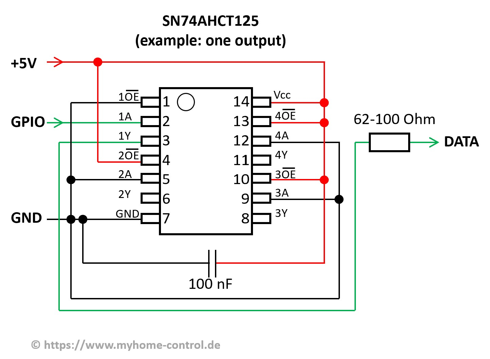
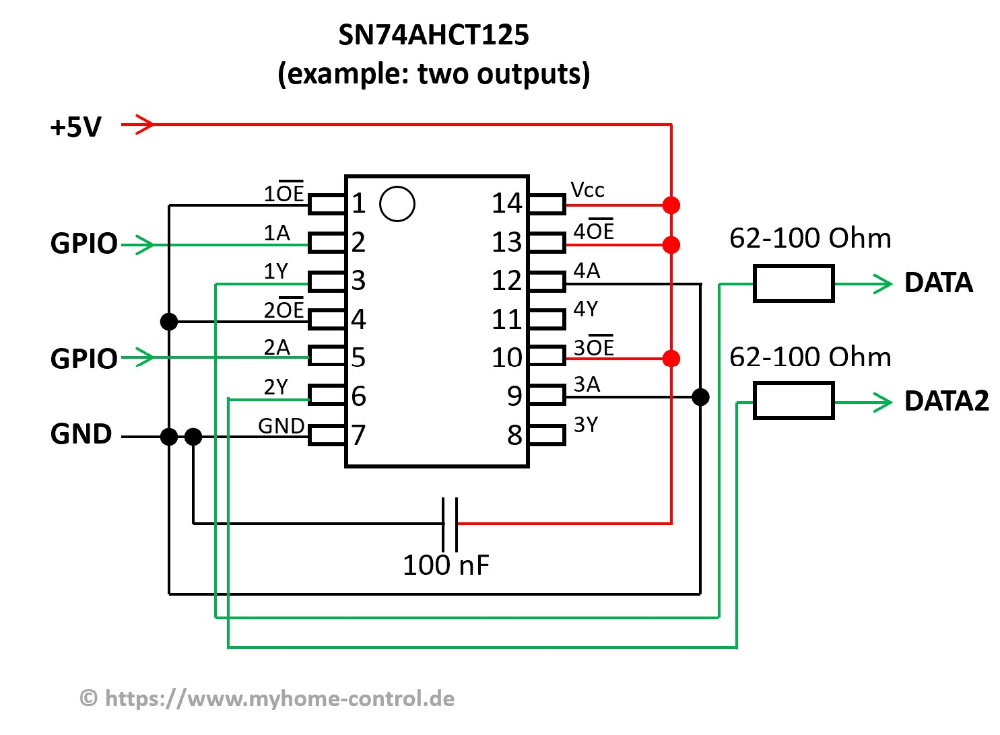

!!! note ""
    Still under construction, feel free to add to the list!

This page lists some third-party hardware and/or tools that are working with WLED!

Please use a decent and neutral description when adding things to this list.

!!! tip
    Lists are in alphabetical order. The position of an item in the list does not indicate how good it is or if it will fit your use case.
    Please carefully compare all items in the category you are interested in, and you should find the one that suits your needs best in just a few minutes! 

## Useful boards and addons

| Name | Description |
|---|---|
[ESP32 Ethernet Network Shield](https://www.tindie.com/products/30385/)| Ethernet Shield (10/100Mbps) for ESP32 boards. Stackable with D1 Mini32 form factor boards.
[Logic Level Shifter Board](https://www.tindie.com/products/sjmelectronics/logic-level-converter-level-shifter) | A simple level shifter board. Updated version has selectable data-pin resistors.
[Logic Level Shifter Shield](https://www.tindie.com/products/sjmelectronics/logic-level-converter-shield)| Logic level shifter shield for Seeed Studio ESP32-C3 and D1 Mini format dev boards. Updated version has selectable data-pin resistors.
[WIZmote remote control](https://www.google.com/search?q=wizmote) | Remote control using radio network. Compatible with WLED (vesions 0.14.0-beta3 and above). No additional receiver required.

## Compatible PC RGB Fans and ARGB accessories

| Brand | Model | Comments |
|---|---|---|
Corsair | HD120 Fan | Uses WS2812B, data-in only
PCCOOLER | Moonlight 5-pack Fans | Uses WS2812B, includes Data-out connector to keep each fan uniquely addressable if wired in series like traditional LED strips
Any | 5v 3-pin ARGB for PC | Any PC RGB device that supports the 5v 3-pin ARGB motherboard header should work fine with WLED. All the major motherboard vendors support the Corsair HD120 and PCCOOLER fans listed, so we can safely assume any device that supports motherboard ARGB 5V 3-Pin standard will work with WLED.

## Levelshifters

| Name | Description |
|---|---|
SN74AHCT125 | Aircoookie's recommended levelshifter. Often used in DIY and commercial controllers. [sjm Level Shifter Board](https://www.tindie.com/products/sjmelectronics/logic-level-converter-level-shifter)
SN74AHCT32 | Same pinout as above can be used. This is just an OR gate, but any AHCT gate can be used if inputs are connected appropriately. ;)
SN74HCT125N | Slower, cheaper version. Works just as well for WS2812, but not recommended for APA102.
SN74LVC2T45 | Modern bus transceiver with voltage translation [Yet Another WLED Controller](https://github.com/lizardsystems/yawl-controller)
TXS0102, TXS0108 | Bidirectional levelshifters that may work fine with WLED (if possible, 74AHCT gates should be preferred as they support both longer data lines and faster protocols)
[F-Amp](https://pixelcontroller.com/store/accessories/54-famp-xconnect.html) | Level shifter/data booster

!!! warning
    I2C shifters are generally too slow for addressable LEDs, so don't use them.

Further reading:
[Logic Level Shifters for Driving LED Strips](https://electricfiredesign.com/2021/03/12/logic-level-shifters-for-driving-led-strips/)

How to connect Levelshifters:

## USB/TTL adapters

| Name | Description |
|---|---|
[CH340](https://www.aliexpress.com/item/32761423124.html) | CH340 module instead of CP2102, PL2303 or FTDI/FTDT. The CH340 can deliver more current which is needed while the flash process depending on the board type. The timing is also much more stable. **For boards with an USB/TTL adapter onboard this is NOT needed**
[ESP uploader](https://github.com/srg74/ESP-uploader) |  CP2102N module. Same USB to UART converter as many recent Dev boards using. Featuring latest USB-C connector. For use with many ESP32, ESP8266, ESP8255 and Tuya based modules. 3.3V logic and 5V power pass through for custom boards.

## Miscellaneous

Sorting: Sensors, Displays, Actuators

| Name | Description |
|---|---|
[HC-SR501](https://www.aliexpress.com/wholesale?catId=0&SearchText=HC-SR501) | PIR sensor with adjustable sensitivity and on time delay (suitable as a button).
[HC-SR602](https://www.aliexpress.com/wholesale?catId=0&SearchText=HC-SR602) | PIR sensor (not suitable as a button but can be used with _PIR sensor_ usermod).
[TSOP38238](https://www.aliexpress.com/item/32834341300.html) | IR receiver compatible with most IR remotes.
[SSD1305](https://www.aliexpress.com/wholesale?catId=0&SearchText=SSD1305) | I2C display, can be used with [_4 Line Display_ usermod](https://github.com/Aircoookie/WLED/tree/master/usermods/usermod_v2_four_line_display).
[SSD1306](https://www.aliexpress.com/wholesale?catId=0&SearchText=SSD1306) | I2C & SPI display, can be used with _4 Line Display_ usermod.
DS18B20 | Recommended temperature sensor for use with WLED. Compatible with the [Temperature usermod](https://github.com/Aircoookie/WLED/tree/master/usermods/Temperature)
[Display shield](https://www.tindie.com/products/27112/) | Various configurations. Compatible with the [ESP32 WLED dev board](https://www.tindie.com/products/27056/) also can be used with ESP32 mini dev boards.
[12V Relay & Fuse board](https://shop.myhome-control.de/Relais-Board-fuer-WLED-Controller-12V/HW10011)|Integrates two relays and two 10 A fuses. Suitable for WLED setups with 12 V LED Strips.
[5V relay](https://www.aliexpress.com/wholesale?catId=0&SearchText=5v+relay+module) | Relay module. Some will require 5V to trigger so you will need level-shifted output (similar as for LEDs) for proper functionality or a circuit with transistor or MOSFET.
[5V Relay & Fuse board](https://shop.myhome-control.de/Relais-Board-fuer-WLED-Controller-5V/HW10005)|Integrates two relays and two 10 A fuses. Suitable for WLED setups with 5V LED Strips.
