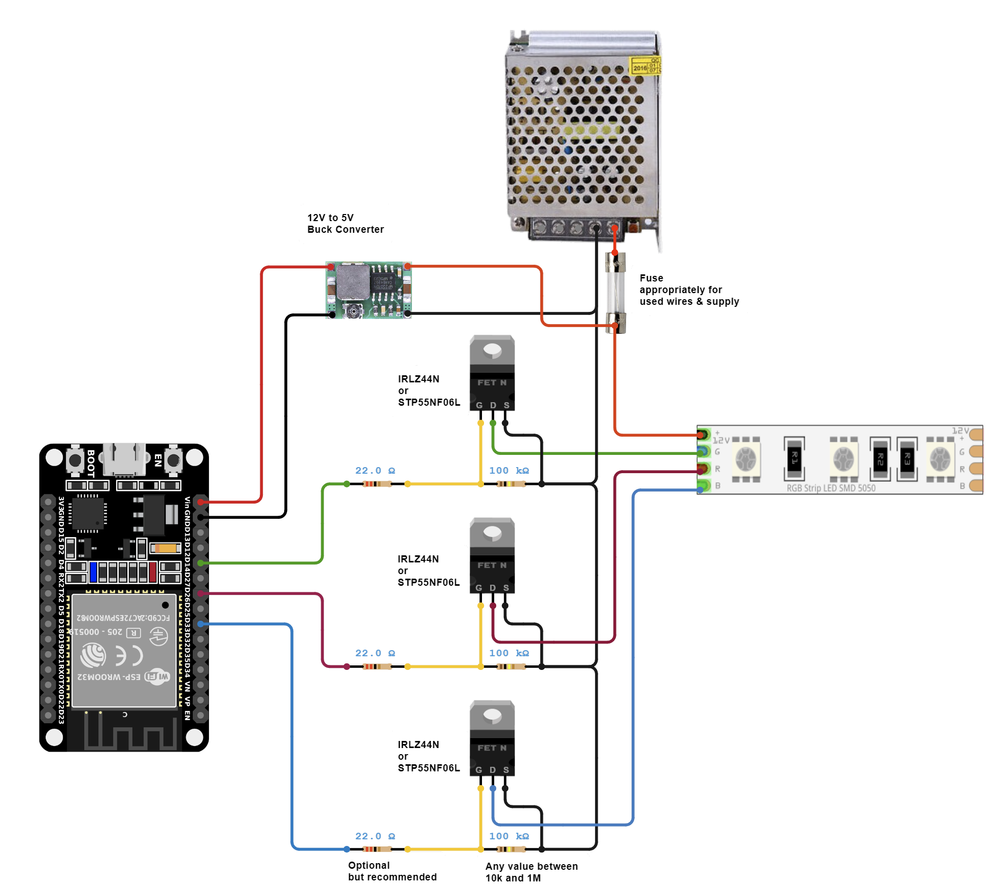
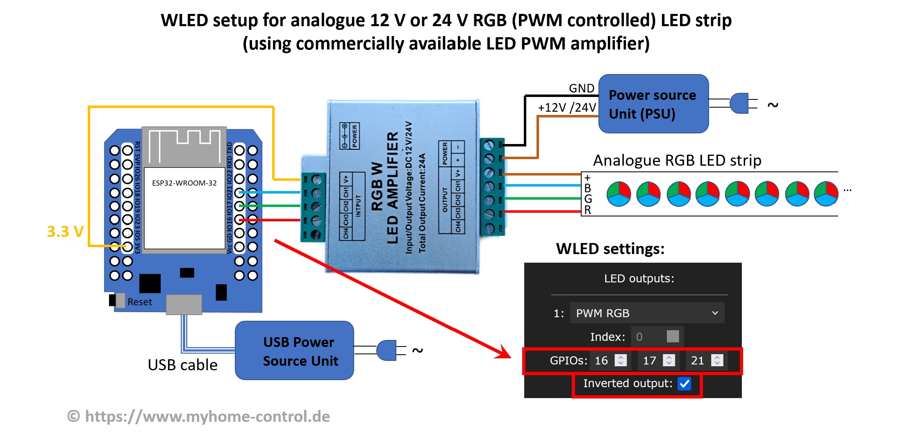
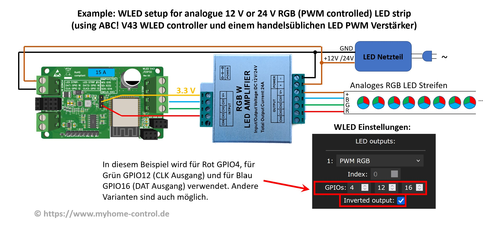
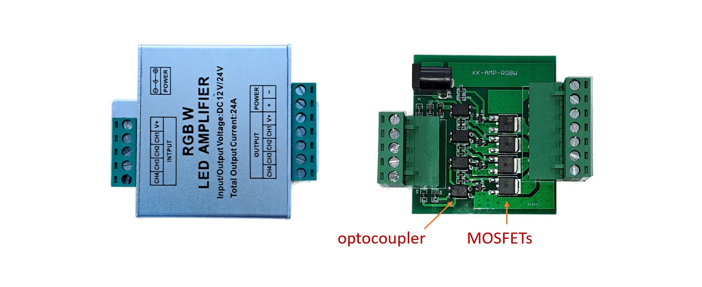

WLED supports two types of LED strips: the so-called digital addressable LED strips and the so-called analog non-addressable LED strips.

## Addressable LED Strips

Addressable LED Strips allows to control individual LEDs separately. This enables you to use many effects. The supported types are listed below. There are sometimes new types coming onto the market that have a compatible control protocol.

Sorting: 5v data only, 5v Data + Clock, 12v data only

| Type | Voltage | Comments |
|---|---|---|
SK6812 | 5&nbsp;V / 12&nbsp;V | RGBW
WS2811 | 5&nbsp;V | usually found in IP68 sealed 12mm pixel strings
WS2812B | 5&nbsp;V |
WS2813 | 5&nbsp;V | has a backup data line
APA102 | 5&nbsp;V | using 2 data pins, Clock and Data
LPD8806 | 5&nbsp;V | using 2 data pins, Clock and Data
WS2801 | 5&nbsp;V | using 2 data pins, Clock and Data
SK9822 | 5&nbsp;V | using 2 data pins, Clock and Data
UCS8903 | 5&nbsp;V |
GS8208 | 12&nbsp;V |
TM1814 | 12&nbsp;V | RGBW
WS2805 | 12&nbsp;V / 24&nbsp;V | RGBCCT, 3-LED groups (12V) / 6-LED groups (24V) as one logical LED. Backup data line. Two white channels for Correlated Color Temperature (CCT) (this option is available since WLED 0.15.0-b2)
WS2811 | 12&nbsp;V | usually 3-LED segments, has data-line resistor
WS2814 | 12&nbsp;V / 24&nbsp;V | RGBW, 3-LED groups (12V) / 6-LED groups (24V) as one logical LED. Must be controlled as SK6812 type, color order: BRG, swap W and G (this option is available since WLED 0.14.0-b1) 
WS2815 | 12&nbsp;V | has a backup data line
FW1906 | 24&nbsp;V | RGBCCT, 6-LED groups as one logical LED. Two white channels for Correlated Color Temperature (CCT) (this option is available since WLED 0.15.0-b2)
LPD6803 | 12&nbsp;V |
P9813 | 5-24&nbsp;V |
TM1829 | 5-24&nbsp;V |
UCS8904 | 5-24&nbsp;V | RGBW

## Non-Addressable LED Strips

WLED supports non-addressable LED strips as well. Unlike addressable strips, non-addressable strips require a pin for each "color" channel and all LEDs are controlled the same way. To drive these strips, additional circuits (MOSFETs) are required. Basic circuit diagrams for RGB strips are shown here. You need one MOSFET and one GPIO per color. It should be noted that the MOSFETs are destroyed very quickly in the event of an overload. To reduce the risk of fire and prevent personal injury, additional circuit elements should be implemented to protect MOSFETs from overtemperature and overload. Depending on the type, fuses are too slow for this! You might consider using self-protected MOSFETs too or the entire MOSFET circuit can be packed into a fire-retardant (e.g. metallic) housing.

Recommended MOSFETs are IRLZ44N or STP55NF06L. A much smaller SMD alternative is the AO3400 which can be used up to 24V and 3A. The pulldown resistor from **G**ate to **S**ource prevents the LEDs turning on when the GPIO is disabled or powered down. The resistor between the GPIO an the **G**ate is to protect the GPIO from overload and reduces voltage ringing. To increase switching speed, add a SN74(A)HCT125 [level shifter](/basics/compatible-hardware#levelshifters) between GPIOs and gate-resistors.

As of v0.13.1, WLED supports single color, CCT, RGB, RGBW and RGBCCT strips. These strips are commonly found at 12 or 24 volts.
The default PWM frequency for dimming is 880 Hz on ESP8266 and 19531 Hz for ESP32.

_See **NOTE** at the end before trying the below amplifiers._

The commercially available so-called RGB(W) LED amplifiers can also be used (also called repeaters/boosters). These typically include optocouplers and MOSFET circuitry (1 to 5 channels) and can be used, for example, as follows:

Note that there is no GND connection between the controller and the amplifier. And this despite the fact that with all other WLED circuits it is always said that all GNDs must be connected to each other. This special feature is due to the fact that the inputs of the amplifier are galvanically decoupled from the outputs by optocouplers and the amplifier in this circuit is used slightly differently than its usual application.

You can connect the GPIOs directly (3.3V signal level) to the input of the amplifier or, if you use a ready-made WLED controller, you can also use the data outputs (of the level shifter, i.e. 5 V signal level). You can also use both at the same time:

The amplifier shown in the picture is a cheap product. Its advantage is a metal case. However, its circuit is very simple:

The simple structure means that the duty cycle of the PWM signal (the ratio between pulse and period duration) at the output is slightly distorted compared to the input. In many cases this is not critical, but it does result in the color composition of an RGB strip being slightly distorted. A significantly better (and slightly more expensive) version is described in <a href="https://media.elv.com/file/143195_led_rgbw_repeater.pdf" target="_blank">this article (in German, includes schematics)</a>. Here the MOSFETs are controlled with push-pull drivers. This and some other measures in the circuit mean that the PWM signal is reproduced very accurately at the output.

**NOTE:** There are some other types of LED amplifiers on the market (e.g. MiBoxer RGBW amplifiers and similar ones) that DO NOT work as described above because they require higher input voltage.
