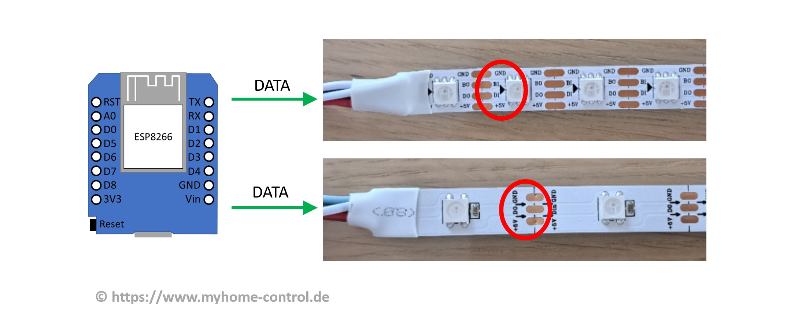
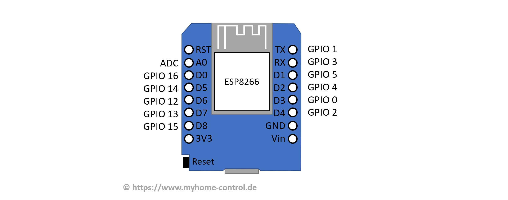
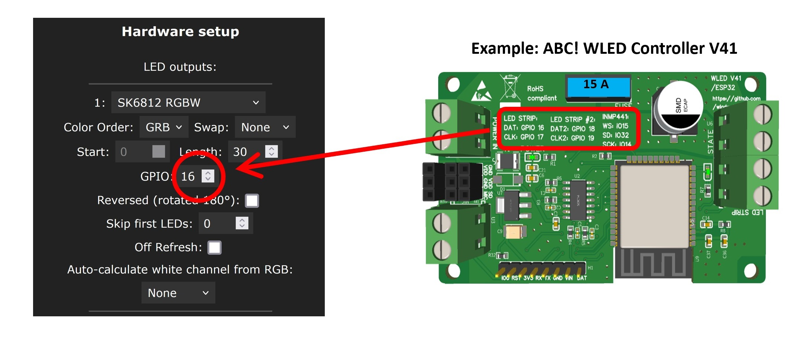
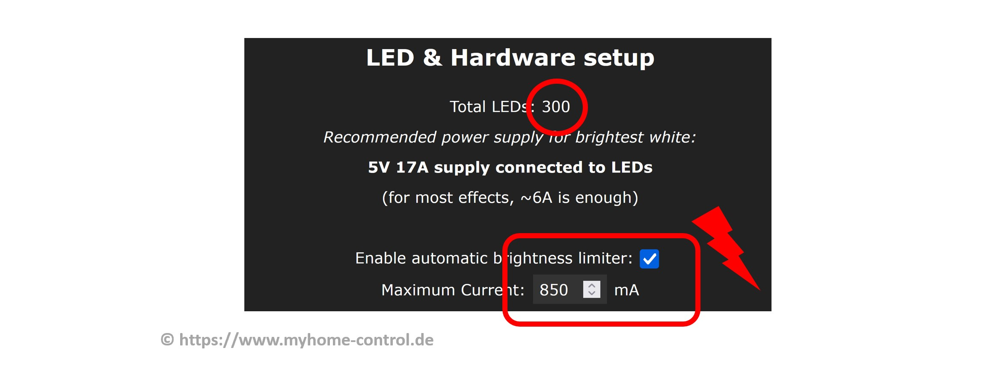

### Asking for help

Before asking for help on Discord or on other platforms, check the following top 5 most common mistakes while setting up WLED.
If you then still have troubles and are going to ask for help, provide as much information as possible: describe your setup, make photos, provide screenshots of your settings.

### TOP 5 mistakes:

1. LED strip is connected from the back side: addressable LED strips have a direction indicated by small arrows on the strip. The data line must be connected from the side where the arrow begins:
    
2. Incorrect GPIO is set: check in WLED settings whether the correct GPIO number is set as data output. Take care while using ESP8266 D1 mini: the pin labels like "D0", "D1" etc. are not the same numbers as GPIOs. In WLED preferences you have to use GPIO numbers:
    
    The ready-to-use controllers usually have the correct settings printed either on the housing or on the circuit board as in this example:
    
3. LED strip with many LEDs is connected and configures, but the current limiter is still at the default value (850 mA). This often has the effect that LEDs either remain dark or flash briefly when the color changes and then go out immediately or light up very dimly. Check and, if necessary, correct the settings in WLED:
    
4. Wrong LED type is set. The correct LED type and the correct color sequence (RGB, BGR, etc.) must be set in WLED LED preferences. Check that these settings are correct. You have to know the LED type, but you can simply try out the color sequence to see which is the right one. Special attention must be paid for example to the WS2814 LED strip, which must be set as SK6812 and not as WS281x in the LED preferences.
    
5. Wiring is bad. Wiring must be done thoroughly. Loose contacts, cold solder joints etc. must be avoided. You also need to be careful about the correct sizing of the cables: too thin wires can not only cause high voltage drop but also lead to an overheating and fire! For wire sizing you may use this [LED power, wiring and fuse calculator](https://wled-calculator.github.io/). If many power sources are used (for example separate one for ESP and separate one for the LED strip), then all their grounds (GND, V-) must be connected together (but do not connect their V+ together!).
