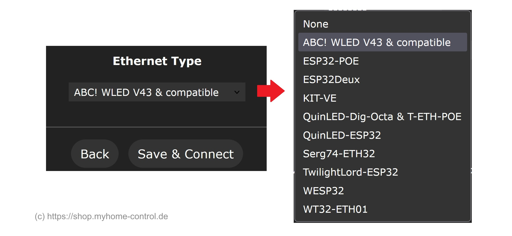

## Introduction

WLED controllers are usually integrated into local network wirelessly (via WiFi). But there is also possibility to integrate WLED Controller into your network via Ethernet (LAN). Currently only ESP32 based controllers support Ethernet (classic, NOT new types like -S2, -C3, -S3 etc.).

## Preconditions and important notes
-	ESP32 based controller with integrated Ethernet or with Ethernet adapter is required.
-	The controller / adapter type must be supported by WLED. The list of supported controllers / adapters can be found below.
-	WLED Software must be compiled with Ethernet support included. Web-based WLED installer have special option for this. Be sure you use right WLED version with Ethernet support.
-	Ethernet requires many GPIOs (see table below). You cannot use them for other purposes at the same time.
-	If you switch from WiFi to Ethernet and you use dynamic (not static) IP addresses via DHCP (that is true in most cases), your WiFi/LAN Router will most likely grant new IP address to the WLED Controller. If you don’t delete WiFi credentials, your Controller will be accessible via WiFi and Ethernet at the same time by two different IP addresses.
-	Ethernet standard requires that the ethernet lines including shield are isolated form the electronics and for EMC reason ceramic capacitor (rated for 2 kV) is connected between Ethernet shield and electronics ground. Unfortunately, many simple/cheap ethernet adapters do not fulfill these requirements. Be careful using them.
-	Most of Ethernet based controllers/ adapters are based on LAN87xx IC. It requires proper reset line. Unfortunately, some simple/cheap adapters do not implement this line correctly that might lead to instabilities especially during boot up.
-	If you connect Ethernet adapter via wires, keep them as short as possible. The communication between ESP32 controller and the adapter is on high speed of 50 MHz that requires proper connection to avoid instabilities.

## Ethernet setup
Go to "Config" and then to "WiFi Setup". At the bottom of this page select the Ethernet type you use. Then click on "Save &  Connect". Ready!

## Ethernet controllers and adapters supported by WLED (as of v0.15 development, June 2024)
Note: all controllers use GPIOs 19, 21, 22, 25, 26, 27 as they are required for ethernet and can not be changed. GPIOs additionally used are given in the table.

| Name | Features | additional GPIOs used |
|---|---|---|
[ABC! WLED V43 & compatible](https://shop.myhome-control.de/Ethernet-Adapter-fuer-WLED-Controller/HW10016) | Isolated shield in accordance with IEEE 802.3 standard; LAN8720 based with proper reset line; adapter developed as Plug& Play solution for [ABC! WLED Controller V43](https://shop.myhome-control.de/ABC-WLED-Controller-Board-5-24V/HW10015) but also might be used with other ESP32 boards | 5, 17, 23, 33
[ESP32-POE](https://github.com/OLIMEX/ESP32-POE/) | General purpose controller with integrated Ethernet | 12, 17, 18, 23
[ESP32-POE-WROVER](https://www.olimex.com/Products/IoT/ESP32/ESP32-POE/open-source-hardware) | ethernet clock connected to a different IO than the ESP32-WROOM module version | 0, 12, 18, 23
ESP32Deux / [RGB2Go Tetra](https://rgb2go.com/products/ethernet-module-for-tetra2go) |  | 17, 18, 23
[KIT-VE](https://docs.espressif.com/projects/esp-idf/en/latest/esp32/hw-reference/esp32/get-started-ethernet-kit.html) | Board from Espressif (ESP microcontroller manufacture company) | 0, 5, 18, 23
[LILYGO T-POE Pro](https://www.lilygo.cc/products/t-poe-pro) |  PoE IEEE802.3 af/at, Input Voltage: 44-57V, Outputs 5V up to 4A | 0, 5, 18, 23
[QuinLED-Dig-Octa](https://quinled.info/quinled-dig-octa/) & [T-ETH-POE](https://www.lilygo.cc/products/t-internet-poe) |  | 17, 18, 23
[QuinLED-ESP32](https://quinled.info/quinled-esp32-ethernet/) |  | 5, 17, 18, 23
[Serg74-ETH32](https://github.com/srg74/ESP32_ethernet) |  | 5, 17, 18, 23
[TwilightLord-ESP32](https://www.hackster.io/news/twilightlord-s-esp32-dev-board-aims-to-improve-on-the-wemos-d1-mini-esp32-and-its-various-clones-3bf449c30d1e) |  | 5, 17, 18, 23
[WESP32](https://wesp32.com/) |  | 0, 16, 17
[WT32-ETH01](https://www.seeedstudio.com/Ethernet-module-based-on-ESP32-series-WT32-ETH01-p-4736.html) |  | 0, 16, 18, 23

