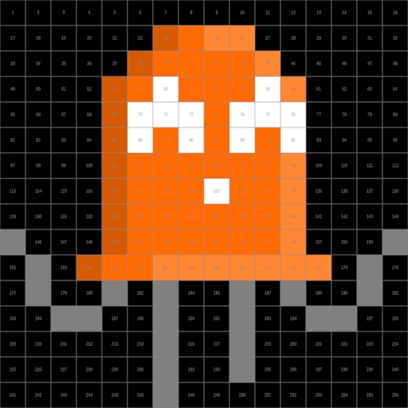

The Pixel Art Converter tool aims to make it easier to show pixel art on a LED matrix panel, by converting any image to 2D pixel art and sending it to the WLED device. The file types PNG, JPG, WEBP and GIF have been tested to work with the tool.

## Installation Approaches

There are three ways to install the pixel art converter:

1. Local web browser. Will a web page run on the local machine connecting to the WLED device but will require fetching an extra file. Supported from WLED release [v0.14.0-b1](https://github.com/Aircoookie/WLED/blob/main/CHANGELOG.md#wled-release-0140-b1) or later
2. Include the pixel art converter in the binary and compile it from the source code. Allows access to the pixel art converter on any device that has a connection to the WLED device. Supported from WLED release [v0.14.0-b2](https://github.com/Aircoookie/WLED/blob/main/CHANGELOG.md#build-2301240) (PR [#3042](https://github.com/Aircoookie/WLED/pull/3042))
3. WLED editor mode. Upload the web page to your WLED device while it is running

### Approach 1: Local Browser

1. Download the `pixartmin.htm` from the [WLED-PixelArtConverter](https://github.com/werkstrom/WLED-PixelArtConverter/) repository
2. Open `pixartmin.htm` in a browser
3. Head over to the [Setup 2D Matrix](#setup-2d-matrix) point

### Approach 2: Include Pixart Converter In Build Files
!!! warning "Compilation required"
    Compiling WLED from the source code is required. Follow the instructions on [compiling WLED](../../advanced/compiling-wled) to do this.

1. Follow the instructions under [Making a custom environment](../../advanced/compiling-wled/#making-a-custom-environment) and set the flag `-D WLED_ENABLE_PIXART` under the line that starts with `build_flags =` in `platformio_override.ini`
2. Compile and flash the binary to the ESP board
3. Power on board and connect via WiFi using the [default login](../../basics/getting-started/)
4. It is now time to [Setup the 2D Matrix](#setup-2d-matrix)

### Approach 3: WLED Editor Mode

!!! note "Network connection"
    A network connection is required to connect to the CDN, hosting the JS library [Ace](https://github.com/ajaxorg/ace), an embedded code editor.

1. Download the `pixartmin.html` file from the [WLED-PixelArtConverter](https://github.com/werkstrom/WLED-PixelArtConverter/) repository
2. Go to the URL `http://[device_ip_address]/edit`
3. Upload the `pixartmin.html` file using the UI
4. Go to `http://[device_ip_address]/pixartmin.html`
5. Now head to the [Setup 2D Matrix](#setup-2d-matrix) point

## Setup 2D Matrix
2D LED panels are natively supported by WLED but need some configuration for the software to show the 2D grid correctly.

1. Head into the `2D Configuration` settings menu in WLED
2. Set the option "Strip or panel" to `2D Matrix`
3. Setup rest of the LED panel layout according to the specifics of your LED panel

!!! tip "Serpentine option"
    Setting the serpentine LED panel option incorrectly can lead to very confusing results that look almost correct but not quite. Enabling or Disabling the option depends on the characteristics of the 2D matrix

## Usage
The Pixel Art Generator does not yet have a link in the WLED front-end, therefore head over to the web page: `http://[device_ip_address]/pixart.htm` (default DHCP IP-address [link](http://4.3.2.1/pixart.htm)).

On the web page:

1. Set the option "LED setup" to 2D matrix or serpentine accordingly.
2. Select an image that should be shown on the matrix display

    

    This example uses a 16x16 pixel, happy version of the WLED mascot Akemi by [Aircoookie](https://github.com/Aircoookie/Akemi).

3. A preview is displayed further down the web page.

    !!! tip "Scaling option"
        It can help to use the `Scale image`  option, depending on the image size used.

    

4. Click on "Send to device" to push the generated image to the WLED device.