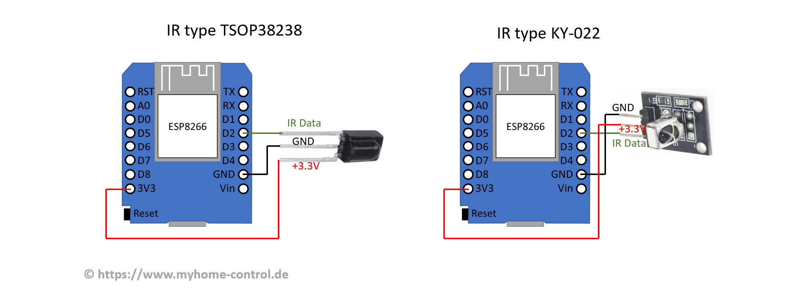

!!! info "Version Info"
    Since v0.8.2, infrared control from various IR remotes is supported for ESP8266 and since v0.9.0 for ESP32, too.

A dedicated infrared receiver module is required and must be connected to the WLED Controller. For example, KY-022 or TSOP38238 are confirmed to work and inexpensive. These receivers each have three pins: 3.3V, GND and IR data. IR data pin must be connected to a free GPIO pin. This GPIO must then be set as IR GPIO under "Config->LED Preferences" (The default sensor pin is GPIO4).

!!! warning
    IR receiving will not work on ESP8266 if you use any LED pin other than GPIO 1, 2, or 3 for _digital_ LED strips.

### Supported IR remotes

To use IR remote go to `Settings`, `Sync Interfaces` and change the value for `Infrared receiver type` according to the IR remote type of the following list:

1. white 24-key IR remote with R,G,B + 12 color-tones  
2. white 24-key IR remote with CT+ / CT- buttons  
3. blue 40-key IR remote with keys for 25%, 50%, 75% and 100%  
4. white 44-key IR remote with up/down arrows for the colors R,G and B  
5. white 21-key IR remote with R,G,B + 9 color-tones  
6. black 6-key IR remote with CH up/down + Vol up/down  
7. [JSON IR remote](json-ir/json_infrared.md) - Easily configure and use any IR remote.  

## ESP-NOW based remote control
Since version WLED 14.0-beta3: An ESP-NOW compatible remote control is supported. An example of this is the „WIZmote“ remote control. This is based on an ESP microcontroller. ESP-NOW can be activated in WLED settings. You have to enter the Hardware MAC address of the remote control. This is determined by clicking on any button on the remote control and copying the last received MAC address from the "Last Seen" field to the "Hardware MAC" field in WLED ESP-NOW settings (“Config->WiFi Setup”) and saving it with "Save". Advantages: no special receiver needs to be attached to the WLED controller and the signals are transmitted via radio network. Therefore there is no line of sight between the remote control and the WLED controller required, as is the case with an IR remote control.

The 4 buttons "1"-"4" of the WIZmote remote control are linked to presets 1 to 4. The meaning of other keys is self-explanatory. Attention: WIZmote needs two good quality AAA batteries to work properly. If the batteries are too weak, the correct signal will not be sent, even if the blue LED on the remote control lights up briefly, actually indicating signal transmission.
